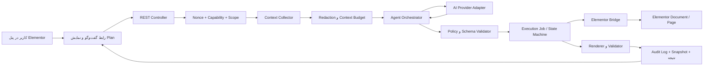

# معماری پیشنهادی افزونهٔ «عامل هوش مصنوعی برای Elementor»

**نویسنده:** Manus AI  
**وضعیت:** سند طراحی فنی برای شروع توسعه  
**دامنه:** WordPress و Elementor، با امکان اتصال به سرویس‌های سازگار با APIهای مدل زبانی

## ۱. تعریف درست محصول

محصول موردنظر نباید صرفاً یک «چت‌بات داخل Elementor» باشد. معماری درست آن یک **عامل مقید به ابزار** است: کاربر هدف را با زبان طبیعی می‌گوید، افزونه وضعیت مجاز صفحه و سایت را به دادهٔ ساخت‌یافته تبدیل می‌کند، مدل فقط یک برنامهٔ قابل‌اعتبارسنجی تولید می‌کند و موتور افزونه، پس از کنترل سیاست‌ها و تأیید کاربر، تغییرات کوچک و قابل‌برگشت را اعمال می‌نماید. مدل زبانی هرگز نباید مستقیماً PHP، JavaScript یا JSON خام Elementor را در دیتابیس بنویسد.

> **اصل کلیدی:** مدل «تصمیم و پیشنهاد» می‌دهد؛ افزونه، پس از اعتبارسنجی قطعی، «اجرا» می‌کند. مدل نباید اختیار نامحدود برای تغییر سایت داشته باشد.

Elementor چیدمان و تنظیمات صفحه را به‌صورت JSON ذخیره می‌کند و هنگام ذخیره آن را در post meta خصوصی WordPress قرار می‌دهد؛ با این حال، این جزئیات ذخیره‌سازی باید در یک لایهٔ سازگاری محصور شود، نه آنکه منطق عامل مستقیماً به meta وابسته شود. ساختارهای صفحه، container، widget، کنترل‌ها و تنظیمات واکنش‌گرا نیز جداگانه تعریف می‌شوند. [1]

## ۲. مرز محصول و وعدهٔ واقعی

عبارت «کل محیط را بخواند» باید به **خواندن محیطِ انتخاب‌شده و مجاز** تبدیل شود. در نسخهٔ اول، عامل می‌تواند دادهٔ لازم برای ساخت یک صفحه را بخواند: سند Elementor صفحهٔ هدف، تنظیمات صفحه، رنگ‌ها و فونت‌های سراسری در صورت انتخاب، فهرست ویجت‌ها و کنترل‌های فعال، کتابخانهٔ رسانهٔ انتخاب‌شده، قالب‌های ذخیره‌شدهٔ مجاز و مشخصات عمومی سایت مانند زبان و جهت نوشتار. این داده‌ها باید به یک snapshot ساخت‌یافته و حداقلی تبدیل شوند.

عامل نباید به‌طور پیش‌فرض رمزها، کلیدهای API، تنظیمات `wp-config.php`، فایل‌های سرور، کوکی‌ها، کاربران و نقش‌ها، سفارش‌ها، فرم‌های ارسالی، نوشته‌های خصوصی، محتوای صفحات خارج از دامنهٔ مأموریت یا اطلاعات شخصی را بخواند یا به ارائه‌دهندهٔ مدل ارسال کند. کاربر مدیر باید پیش از هر گفتگو، دامنهٔ دادهٔ قابل‌استفاده را ببیند و امکان محدودکردن آن را داشته باشد.

| قابلیت | نسخهٔ اولیهٔ پیشنهادی | علت |
|---|---|---|
| ساخت یا ویرایش صفحهٔ انتخاب‌شده | بله، فقط در Draft یا پیش‌نمایش | کنترل ریسک و امکان بازبینی |
| تحلیل ویجت‌ها و تنظیمات فعال همان سایت | بله، فقط از کاتالوگ قابلیت | جلوگیری از ساخت تنظیمات نامعتبر |
| ساخت صفحه از چند widget اصلی Elementor | بله | بیشترین ارزش با کمترین سطح ناسازگاری |
| پشتیبانی از widgetهای افزونه‌های ثالث | پس از ساخت adapter اختصاصی | کنترل‌ها و وابستگی‌ها در هر افزونه متفاوت‌اند |
| ویرایش انبوه تمام صفحات یا Templateها | خیر در نسخهٔ اول | ریسک تخریب و دشواری rollback |
| انتشار، حذف، تغییر URL، فرم، پرداخت یا اجرای اسکریپت | فقط با تأیید صریح و در نسخه‌های بعد | عملیات حساس یا برگشت‌ناپذیر |

## ۳. معماری کلان



لایهٔ رابط کاربری، یک پنل اختصاصی داخل ویرایشگر Elementor و یک صفحهٔ تنظیمات در مدیریت WordPress دارد. لایهٔ REST فقط رابط بین JavaScript و هسته است؛ نباید منطق حساس یا کلید API در مرورگر داشته باشد. Context Collector وضعیت موردنیاز را استخراج و پاک‌سازی می‌کند. Orchestrator، گفتگو و چرخهٔ برنامه را مدیریت می‌کند. Provider Adapter تفاوت‌های OpenAI-compatible، Anthropic، Gemini یا endpoint خصوصی را پنهان می‌نماید. Policy Engine تنها خروجی مطابق schema و مجاز را می‌پذیرد. Elementor Bridge تنها بخش مجاز برای خواندن و تغییر سند Elementor است. در پایان، Audit Log گزارش غیرقابل‌ابهام از درخواست، plan، actionها، خطاها، نسخهٔ قبل و نتیجه نگه می‌دارد.

## ۴. نقش‌ها و مسئولیت‌ها

| لایه | مسئولیت | نباید انجام دهد |
|---|---|---|
| UI Panel | دریافت دستور، نمایش وضعیت، Plan و درخواست تأیید | نگهداری کلید API یا اعمال مستقیم تغییر در سند |
| REST Controller | احراز هویت، اعتبارسنجی اولیه و پاسخ استاندارد | تماس مستقیم و بدون محدودیت با provider |
| Context Collector | ساخت snapshot کمینه از محیط مجاز | ارسال دادهٔ خام، خصوصی یا نامحدود به مدل |
| Agent Orchestrator | مدیریت session، درخواست plan و انتخاب مرحلهٔ بعد | نوشتن مستقیم در post meta یا اعتماد به متن آزاد مدل |
| Tool Registry | معرفی ابزارهای محدود و JSON schema ورودی هر ابزار | expose کردن هر API یا قابلیت WordPress به مدل |
| Policy Engine | کنترل scope، ریسک، بودجه، allowlist و تأییدها | حدس‌زدن یا اصلاح بی‌صدای تغییر مخرب |
| Elementor Bridge | ترجمهٔ action تأییدشده به عملیات سند و ذخیره | اجرای actionی که validator تأیید نکرده است |
| Job Runner | اجرای گام‌به‌گام، retry و ادامه‌دادن اجرای کوتاه | اجرای هم‌زمانِ متعارض روی یک صفحه |
| Audit/Snapshot | قابلیت مشاهده، rollback و تشخیص مشکل | ثبت secret یا محتوای حساس بدون ماسک |

## ۵. مدل دسترسی

قابلیت‌های WordPress باید در لایهٔ سرور بررسی شوند. nonce فقط از درخواست‌های جعلی بین‌سایتی محافظت می‌کند و جایگزین احراز هویت یا کنترل دسترسی نیست؛ مستندات WordPress صریحاً استفاده از `current_user_can()` را کنار nonce ضروری می‌داند. [2] برای REST API نیز هر مسیر خصوصی باید `permission_callback` داشته باشد و ورودی آن قبل از callback اصلی اعتبارسنجی و پاک‌سازی شود. [3]

| عملیات | capability حداقل | تأیید تعاملی |
|---|---|---|
| مشاهدهٔ پنل و برنامهٔ پیشنهادی | `edit_post` برای همان صفحه | خیر |
| ساخت یا تغییر Draft همان صفحه | `edit_post` برای همان صفحه | بله، برای نخستین Apply هر Plan |
| ذخیرهٔ تنظیمات provider و کلید | `manage_options` | بله، تست اتصال جداگانه |
| تغییر Template سراسری، Global Style یا Kit | `edit_theme_options` و سیاست جداگانه | بله، برای هر اجرا |
| انتشار صفحه | `publish_pages` یا capability متناظر post type | بله، یک تأیید مستقل |
| حذف عنصر یا جایگزینی کامل سند | `edit_post` و امکان `delete_post` در صورت نیاز | بله، همراه با نمایش اثر |

## ۶. چرخهٔ اجرای عامل

چرخه باید به صورت یک state machine پایدار باشد و هر گام وضعیت قابل‌نمایش داشته باشد: `draft_context → planning → waiting_for_approval → executing → validating → completed | failed | cancelled | rolled_back`. در هر تغییر، یک snapshot یا revision marker ثبت می‌شود. اگر کاربر یا همکار دیگری در حین اجرا صفحه را تغییر دهد، hash سند تغییر می‌کند و job باید متوقف شود؛ سپس کاربر می‌تواند context جدید بگیرد و plan را دوباره بسازد.

| مرحله | ورودی | خروجیِ لازم | قاعدهٔ توقف |
|---|---|---|---|
| جمع‌آوری context | صفحه، scope و سیاست کاربر | snapshot نسخه‌دار و redacted | دادهٔ حساس یا scope نامعتبر |
| برنامه‌ریزی | هدف کاربر و snapshot | Plan دارای actionهای محدود و معیار پذیرش | خروجی ناقص یا ناسازگار با schema |
| بازبینی | Plan و preview اثر | تأیید کاربر یا درخواست اصلاح | رد کاربر یا ابهام در اقدام پرریسک |
| اجرا | یک action تأییدشده در هر بار | receipt شامل before/after و revision | conflict، timeout یا نقض policy |
| اعتبارسنجی | سند تغییرکرده | خطاهای ساختاری، گزارش render و معیار پذیرش | widget ناموجود، تنظیم نامعتبر یا خطا |
| پایان | همهٔ receiptها و checkها | وضعیت نهایی، خلاصه و امکان rollback | وجود هر گام ناتمام |

اجرای برنامه باید **دانه‌دانه** باشد، اما هر action باید کوچک، قابل‌تکرار و idempotent طراحی شود. برای نمونه `add_widget` با `action_id` یکتا انجام می‌شود؛ retry همان action نباید یک widget دوم بسازد. نتیجهٔ هر action در UI نشان داده می‌شود، نه فقط یک پیام کلی مانند «انجام شد».

## ۷. قرارداد خروجی مدل

مدل باید فقط JSON معتبر مطابق JSON Schema بازگرداند. پاسخ آزاد، کد PHP، HTML دلخواه یا JSON خام Elementor نباید مستقیماً قابل‌اجرا باشد. مدل از Tool Registry فقط ابزارهای مجاز را می‌بیند؛ مانند `create_container`، `add_widget`، `set_widget_content`، `set_widget_style`، `move_element`، `set_page_settings`، `validate_document` و `request_user_input`. هر ابزار ورودی type-safe، محدودیت اندازه، allowlist ویجت و مسیرهای مجاز تنظیمات دارد.

نمونهٔ معنایی یک action این است: «در container با شناسهٔ داخلی X یک Heading از widgetهای فعال بساز، متن Y، تراز راست، سطح semantic H1، و فاصلهٔ بالا Z». Elementor Bridge پس از آن تعیین می‌کند که این intent با نسخهٔ Elementor و schema واقعی آن سایت چگونه به سند تبدیل شود. این جداسازی بسیار مهم است؛ زیرا Elementor مجموعه‌ای از widgetهای دسته‌بندی‌شده با کنترل‌های اختصاصی دارد و توسعه‌دهندگان افزونه نیز می‌توانند widget اضافه یا حذف کنند. [4]

## ۸. تصمیم‌های معماری که نباید نقض شوند

اول، هیچ کلید API به JavaScript، localStorage، پاسخ REST یا log ارسال نمی‌شود. دوم، Provider Adapter هرگز URL دلخواه را بدون اعتبارسنجی مقصد فراخوانی نمی‌کند. سوم، کل دیتابیس یا HTML کامل سایت برای مدل فرستاده نمی‌شود؛ از context خلاصه‌شده با بودجهٔ مشخص استفاده می‌شود. چهارم، تغییر مستقیم و پراکندهٔ `_elementor_data` از لایه‌های دیگر ممنوع است. پنجم، انتشار یا تغییرات مخرب با یک پیام زبانی مبهم قابل‌اجرا نیست؛ باید action ساخت‌یافته و تأیید صریح وجود داشته باشد.


## ۹. ساختار پیشنهادی فایل‌ها

ساختار باید از ابتدا ماژولار باشد تا منطق Elementor، providerهای AI و رابط کاربری به هم گره نخورند. نام نمونهٔ افزونه در این سند `elementor-ai-agent` است و در همهٔ namespaceها از `ElementorAIAgent` استفاده می‌شود. فایل اصلی فقط bootstrap و بررسی dependencyها را انجام می‌دهد؛ هیچ business logic در فایل اصلی قرار نگیرد.

```text
elementor-ai-agent/
├── elementor-ai-agent.php               # bootstrap، header، dependency gate
├── uninstall.php                        # حذف اختیاری داده‌ها، فقط با رضایت مدیر
├── readme.txt                           # مطابق استاندارد WordPress.org
├── composer.json                        # autoload PSR-4 و ابزارهای توسعه
├── languages/
├── assets/
│   ├── build/                           # خروجی نسخه‌دار JS/CSS
│   └── src/
│       ├── editor/                      # پنل React داخل Elementor editor
│       ├── admin/                       # صفحهٔ تنظیمات WordPress
│       └── shared/                      # typeها، client REST، i18n
├── src/
│   ├── Plugin.php                       # composition root و hook registration
│   ├── Admin/
│   │   ├── SettingsPage.php
│   │   ├── SettingsSanitizer.php
│   │   └── Capabilities.php
│   ├── Editor/
│   │   ├── EditorAssets.php
│   │   ├── PanelBootstrap.php
│   │   └── EditorContextBridge.php
│   ├── Rest/
│   │   ├── Routes.php
│   │   ├── SessionController.php
│   │   ├── PlanController.php
│   │   ├── ExecutionController.php
│   │   ├── ContextController.php
│   │   └── RestError.php
│   ├── Agent/
│   │   ├── Orchestrator.php
│   │   ├── ConversationService.php
│   │   ├── PlanService.php
│   │   ├── StateMachine.php
│   │   ├── ContextBudget.php
│   │   └── PromptBuilder.php
│   ├── AI/
│   │   ├── ProviderInterface.php
│   │   ├── ProviderRegistry.php
│   │   ├── OpenAICompatibleProvider.php
│   │   ├── AnthropicProvider.php         # فقط در صورت نیاز واقعی
│   │   ├── HttpClient.php
│   │   └── SecretVault.php
│   ├── Tools/
│   │   ├── ToolRegistry.php
│   │   ├── ToolDefinition.php
│   │   ├── CreateContainerTool.php
│   │   ├── AddWidgetTool.php
│   │   ├── UpdateSettingsTool.php
│   │   ├── MoveElementTool.php
│   │   ├── DeleteElementTool.php
│   │   └── ValidateDocumentTool.php
│   ├── Elementor/
│   │   ├── ElementorGuard.php
│   │   ├── DocumentRepository.php
│   │   ├── CapabilityCatalog.php
│   │   ├── ElementSchemaRegistry.php
│   │   ├── DocumentTransaction.php
│   │   ├── Renderer.php
│   │   └── Compatibility/
│   │       ├── CoreWidgetsAdapter.php
│   │       └── ThirdPartyAdapters.php
│   ├── Policy/
│   │   ├── PolicyEngine.php
│   │   ├── ScopePolicy.php
│   │   ├── RiskClassifier.php
│   │   ├── ApprovalPolicy.php
│   │   └── SchemaValidator.php
│   ├── Jobs/
│   │   ├── JobRepository.php
│   │   ├── JobRunner.php
│   │   ├── RetryPolicy.php
│   │   └── LockManager.php
│   ├── Audit/
│   │   ├── AuditLogger.php
│   │   ├── SnapshotRepository.php
│   │   └── RollbackService.php
│   ├── Domain/
│   │   ├── DTO/
│   │   ├── Enum/
│   │   ├── Exception/
│   │   └── ValueObject/
│   └── Support/
│       ├── Sanitizer.php
│       ├── Encryption.php
│       ├── Clock.php
│       └── Logger.php
├── templates/
│   ├── admin-settings.php
│   └── editor-panel-root.php
└── tests/
    ├── Unit/
    ├── Integration/
    ├── E2E/
    └── Fixtures/
```

در PHP از `declare(strict_types=1)`، type declaration کامل، namespaceهای PSR-4، value objectهای immutable و exceptionهای دامنه‌ای استفاده کنید. ارتباط کلاس‌ها از طریق interface و تزریق وابستگی انجام شود. کلاسی که Provider خارجی را فراخوانی می‌کند نباید از Elementor یا `$_POST` خبر داشته باشد؛ به‌همین ترتیب، کلاسی که سند Elementor را تغییر می‌دهد نباید prompt یا کلید API ببیند.

## ۱۰. داده‌ها و ذخیره‌سازی

تنظیمات کوچک و غیرحساس می‌توانند در `wp_options` با autoload برابر `no` ذخیره شوند. برای sessionها، planها، action receiptها، logهای حسابرسی و snapshotها، جدول سفارشی بهتر از option یا post meta است؛ چون query، retention، index، پاک‌سازی و حجم آن‌ها قابل‌کنترل‌تر خواهد بود. migrationها باید با `dbDelta()` و شمارهٔ نسخهٔ schema اجرا شوند؛ هر migration idempotent و قابل‌آزمون باشد.

| جدول/مخزن | نمونهٔ فیلدهای اصلی | هدف | نگهداری پیشنهادی |
|---|---|---|---|
| `wp_eaia_sessions` | `id`, `user_id`, `post_id`, `scope_json`, `context_hash`, `status`, `created_at` | نشست گفتگو و scope | ۳۰ تا ۹۰ روز، قابل تنظیم |
| `wp_eaia_messages` | `session_id`, `role`, `content_redacted`, `token_count`, `created_at` | تاریخچهٔ حداقلی گفتگو | هم‌زمان با session |
| `wp_eaia_plans` | `id`, `session_id`, `version`, `plan_json`, `risk_level`, `approval_state` | Plan نسخه‌دار و تأییدپذیر | تا حذف session یا policy سازمان |
| `wp_eaia_jobs` | `id`, `plan_id`, `post_id`, `state`, `cursor`, `document_hash`, `locked_until` | اجرای مرحله‌ای و بازیابی‌پذیر | ۹۰ روز برای گزارش |
| `wp_eaia_action_receipts` | `job_id`, `action_id`, `before_hash`, `after_hash`, `result_json`, `error_code` | idempotency و گزارش هر گام | ۹۰ روز یا بیشتر |
| `wp_eaia_snapshots` | `id`, `post_id`, `source`, `document_json_compressed`, `hash`, `expires_at` | rollback محدود و امن | تعداد/حجم محدود، مثلاً ۱۰ نسخهٔ اخیر |
| `wp_eaia_audit_log` | `actor_id`, `event`, `object_type`, `object_id`, `metadata_redacted`, `created_at` | audit غیرقابل‌ابهام | مطابق policy حریم خصوصی |

کلیدهای provider در جدول log یا session و در payload مرورگر ذخیره نمی‌شوند. مقدار رمز‌شدهٔ کلید باید به‌همراه `key_id` نگه‌داری شود؛ کلید رمزنگاری از secretهای server-side سایت، نه از database، به‌دست آید. اگر محیط میزبانی امکان مدیریت secret مناسب ندارد، روش امن‌تر استفاده از ثابت تعریف‌شده در `wp-config.php` یا یک proxy سمت سرور مستقل است. نمایش کلید در UI فقط به‌صورت ماسک‌شده مانند `sk-...9A2F` انجام شود.

## ۱۱. کاتالوگ قابلیت Elementor

چون widgetها و کنترل‌ها در هر سایت بسته به Elementor، Pro و افزونه‌های جانبی متفاوت‌اند، در زمان باز شدن editor یک `CapabilityCatalog` تولید و cache کوتاه‌مدت می‌شود. این کاتالوگ منبع حقیقت برای مدل و validator است. هر action پیش از اجرا دوباره با کاتالوگ فعلی بررسی می‌شود؛ cache برای تصمیم نهایی کافی نیست.

```json
{
  "catalog_version": "hash",
  "elementor_version": "detected-at-runtime",
  "widgets": [
    {
      "widget_type": "heading",
      "category": "basic",
      "allowed_controls": ["title", "header_size", "align", "text_color"],
      "required_controls": ["title"],
      "risk": "low"
    }
  ],
  "allowed_page_settings": ["page_title_selector", "background_background"],
  "disabled_widgets": ["html", "shortcode"],
  "adapters": ["elementor-core@detected"]
}
```

در نسخهٔ اولیه widgetهای دارای امکان اجرای کد، shortcode، HTML خام، فرم‌های پرداخت، login، درج script و اتصال به سرویس‌های بیرونی باید به‌طور پیش‌فرض غیرفعال باشند. widgetهای افزونه‌های ثالث تا زمانی که adapter، schema و تست integration اختصاصی ندارند در کاتالوگ عامل ظاهر نشوند. این تصمیم، کیفیت خروجی را بیشتر از افزودن سریع صدها widget افزایش می‌دهد.

## ۱۲. قراردادهای REST داخلی

همهٔ endpointها زیر namespace نسخه‌دار `elementor-ai-agent/v1` ثبت می‌شوند. فقط درخواست احراز هویت‌شدهٔ داخل admin/editor مجاز است؛ CORS باز، endpoint عمومی برای chat و دریافت کلید وجود ندارد. requestهای mutation باید nonce، capability، شناسهٔ صفحه و `If-Match`/`context_hash` معتبر داشته باشند. هر پاسخ شامل `request_id` برای عیب‌یابی است.

| Method و مسیر | درخواست | پاسخ | شرط دسترسی |
|---|---|---|---|
| `POST /sessions` | `post_id`, `scope` | `session_id`, `context_summary`, `context_hash` | `edit_post(post_id)` |
| `GET /catalog?post_id=` | شناسهٔ صفحه | widgetها و تنظیمات مجاز | `edit_post(post_id)` |
| `POST /sessions/{id}/messages` | `message`, `context_hash` | پاسخ گفتگو یا `plan_id` | مالک session و `edit_post` |
| `GET /plans/{id}` | — | plan خوانا، actionها و risk | مجوز صفحهٔ session |
| `POST /plans/{id}/approve` | `approved_action_ids`, `context_hash` | `job_id` یا نیاز به تأیید بیشتر | مجوز صفحه + policy |
| `POST /jobs/{id}/run-next` | `context_hash` | receipt یک گام و state جدید | مجوز صفحه، job lock |
| `GET /jobs/{id}` | — | status، progress و error امن | مجوز صفحه |
| `POST /jobs/{id}/cancel` | — | state=`cancelled` | مجوز صفحه |
| `POST /jobs/{id}/rollback` | `snapshot_id` | receipt rollback | مجوز صفحه + confirmation |
| `POST /providers/test` | `provider_id` | latency، model list محدود، خطای ماسک‌شده | `manage_options` |

برای جلوگیری از دوباره‌کاری ناشی از retry مرورگر، همهٔ POSTهای تغییر‌دهنده باید هدر `Idempotency-Key` داشته باشند. پاسخ با همان کلید، action جدید ایجاد نمی‌کند؛ receipt قبلی را بازمی‌گرداند. در خطای conflict، API کد مشخص مانند `eaia_context_conflict` و نسخهٔ جدید سند را گزارش می‌کند، اما تغییر را ادامه نمی‌دهد.

## ۱۳. schema برنامه و actionها

Plan باید برای انسان قابل‌خواندن و برای ماشین قابل‌اعتبارسنجی باشد. یک Plan شامل هدف، فرض‌ها، دامنه، معیار پذیرش، درجهٔ ریسک، actionهای مرتب، وابستگی هر action و وضعیت تأیید است. برای کاهش توهم مدل، schema با `additionalProperties: false` بسته باشد و actionها union type محدود باشند.

```json
{
  "schema_version": "1.0",
  "goal": "ساخت hero راست‌چین برای صفحهٔ معرفی خدمت",
  "assumptions": ["زبان سایت فارسی است", "فقط صفحهٔ Draft تغییر می‌کند"],
  "acceptance_criteria": ["یک H1 دارد", "دکمه CTA قابل‌مشاهده است", "در موبایل روی‌هم قرار می‌گیرد"],
  "risk_level": "medium",
  "actions": [
    {
      "id": "a-001",
      "tool": "create_container",
      "depends_on": [],
      "args": {"parent": "root", "direction": "row", "content_width": "boxed"},
      "requires_approval": true
    },
    {
      "id": "a-002",
      "tool": "add_widget",
      "depends_on": ["a-001"],
      "args": {"parent": "$a-001", "widget_type": "heading", "settings": {"title": "عنوان نمونه", "header_size": "h1"}},
      "requires_approval": false
    }
  ]
}
```

در مرحلهٔ planning، مدل فقط ابزارهای read-only و تولید Plan دارد. در مرحلهٔ execution نیز افزونه فقط actionهایی را اجرا می‌کند که هم در schema معتبرند، هم در capability catalog هستند، هم برای scope فعلی مجازند و هم کاربر در صورت نیاز تأیید کرده است. خروجی مدل هرگز اعتماد پیش‌فرض ندارد.

## ۱۴. نقطهٔ اتصال به Elementor

`ElementorGuard` در bootstrap ابتدا وجود Elementor، نسخهٔ سازگار و آماده‌بودن editor را کنترل می‌کند؛ در غیر این صورت، افزونه غیرفعال نمی‌شود اما پنل با پیام پیش‌نیاز و بدون endpoint اجرایی نمایش داده می‌شود. `DocumentRepository` از APIهای عمومی و نقطه‌های توسعهٔ پایدار Elementor استفاده می‌کند. هر دسترسی به ساختار داخلی یا meta باید فقط از این لایه عبور کند تا در تغییر نسخهٔ Elementor اصلاح در یک نقطه انجام شود.

برای تغییر سند، `DocumentTransaction` این الگو را اجرا می‌کند: سند را دوباره می‌خواند، hash آن را با `context_hash` مقایسه می‌کند، snapshot می‌سازد، intent را با adapter تبدیل می‌کند، سند را از راه API Elementor به‌روزرسانی می‌کند، دادهٔ resulting را دوباره parse و validate می‌کند، cache/CSS بازتولیدشده را از راه hookهای رسمی پاک‌سازی می‌کند و receipt را ثبت می‌نماید. اگر هر مرحله شکست خورد، تغییر ذخیره‌شده باید rollback شود یا job به وضعیت `failed_needs_review` برود؛ هیچ «موفقیت ظاهری» قابل‌قبول نیست.


## ۱۵. اصول امنیتی غیرقابل‌مذاکره

چون افزونه هم به provider بیرونی وصل می‌شود و هم توان تغییر محتوای صفحه را دارد، باید با آن مانند یک سطح مدیریتی حساس رفتار کنید. اصل امنیتی این است که **حداقل دسترسی، حداقل داده و حداقل اثر** در هر مرحله اجرا شود. WordPress برای APIهای خصوصی استفاده از permission callback را لازم می‌داند و ورودی مسیرها و پارامترها را دادهٔ غیرقابل‌اعتماد تلقی می‌کند. [3]

| تهدید | کنترل الزامی | معیار پذیرش |
|---|---|---|
| CSRF در پنل یا REST | nonce در هر mutation، بررسی origin در UI، و capability سمت سرور | درخواست جعلی بدون nonce رد شود |
| دسترسی افقی به صفحهٔ دیگر | `edit_post($post_id)` در هر endpoint و تطبیق post_id با session/job | کاربر فقط صفحه‌های مجاز خود را ببیند |
| نشت API key | Vault رمزنگاری‌شده، mask، ممنوعیت log و عدم ارسال به browser | جست‌وجوی log و response کلید کامل را پیدا نکند |
| SSRF از endpoint سفارشی | allowlist scheme/host، منع IP خصوصی و redirect کنترل‌شده | URL داخلی یا متادیتای cloud فراخوانی نشود |
| Prompt injection در محتوای صفحه | دادهٔ سایت به‌عنوان data با مرزبندی، نه instruction؛ ابزارهای محدود | متن صفحه نتواند policy یا ابزار جدید فعال کند |
| اجرای کد یا XSS | منع HTML/shortcode/script در MVP، escaping خروجی، schema سخت‌گیر | مدل نتواند `script`، handler یا shortcode تزریق کند |
| تخریب صفحه | snapshot، approval، actionهای کوچک، hash conflict و rollback | عملیات ناموفق اثر ناتمام باقی نگذارد |
| هزینه/سوءاستفاده AI | rate limit کاربر/سایت، سقف token و درخواست، quota provider | استفادهٔ تکراری کنترل‌نشده متوقف شود |
| افشای دادهٔ شخصی | data minimization، redaction، retention و صفحهٔ حریم خصوصی | دادهٔ غیرلازم به provider ارسال نشود |
| تغییر رفتار افزونهٔ ثالث | adapter + integration test + feature flag | widget ناشناخته هرگز خودکار تغییر نکند |

### ۱۵.۱ احراز هویت، مجوز و ورودی

هر endpoint تغییر‌دهنده باید به‌صورت هم‌زمان nonce، capability، ownership session، scope، idempotency key و hash سند را بررسی کند. nonce به تنهایی کفایت نمی‌کند؛ مستندات WordPress صریحاً بیان می‌کند که nonce مکانیزم authentication، authorization یا access control نیست. [2] تمام inputها در مرز دریافت validate و sanitize می‌شوند و تمام خروجی‌های نمایش‌داده‌شده متناسب با context escape می‌گردند. هیچ فرضی دربارهٔ معتبر بودن `post_id`، نام widget، مسیر setting یا محتوای پیام کاربر نکنید.

### ۱۵.۲ حریم خصوصی و ارسال context

کاربر باید پیش از آغاز یک session بداند چه داده‌ای به provider می‌رود و کدام provider انتخاب شده است. snapshot ارسالی باید متن‌های نامرتبط، شناسه‌های کاربری، ایمیل، token، URL امضاشده، محتوای فرم و metaهای حساس را حذف یا جایگزین کند. برای هر Provider یک `Data Processing Mode` تعریف کنید: «فقط ساختار»، «ساختار + متن صفحهٔ جاری»، یا «متن انتخاب‌شده». حالت پیش‌فرض باید محافظه‌کارانه باشد.

چت و logها باید policy retention قابل‌تنظیم داشته باشند و دکمهٔ حذف تاریخچه یا پاک‌سازی نشست داشته باشند. اگر افزونه در WordPress.org منتشر می‌شود، باید متن Privacy Policy و اسناد disclosure روشن دربارهٔ ارسال داده به سرویس بیرونی داشته باشد. هر provider خارجی فقط پس از تأیید مدیر سایت و با URL و مدل مشخص قابل‌فعال‌سازی است.

### ۱۵.۳ مدیریت endpoint و کلید provider

صفحهٔ تنظیمات باید providerهای شناخته‌شده را با یک adapter مستقل نشان دهد و برای endpoint سفارشی اعتبارسنجی شدید داشته باشد. `https` الزامی باشد مگر اینکه نصب محلی در حالت توسعه صریحاً مجاز شده باشد. hostname، پورت، مسیر پایه، redirect، timeout، تعداد retry و اندازهٔ پاسخ محدود شوند. لاگ خطا باید status code، request id و طبقهٔ خطا را نگه دارد، نه header Authorization، prompt کامل یا پاسخ حساس provider را.

## ۱۶. پایداری، صف و کنترل هم‌زمانی

عملیات‌های ساخت صفحه به ویژه در پاسخ‌های طولانی نباید در یک درخواست PHP بلندمدت اجرا شوند. UI باید یک job بسازد و هر بار فقط یک action یا دستهٔ بسیار کوچک از actionهای غیرحساس را با زمان‌سنج کنترل‌شده اجرا کند. برای سایت‌های کم‌ترافیک یک runner متکی بر درخواست‌های بعدی و WP-Cron می‌تواند fallback باشد؛ برای محیط‌های حرفه‌ای، cron واقعی سرور یا runner مطمئن‌تر نیاز است. پردازش agent نباید به بازماندن tab مرورگر وابسته باشد، اما اجرای نسخهٔ اول می‌تواند تا پایان اجرا پنل را باز نگه دارد و پس از آن قابلیت resume افزوده شود.

| موضوع | روش طراحی |
|---|---|
| Lock صفحه | lock اتمیک بر پایهٔ `post_id` و `job_id` با TTL کوتاه و heartbeat |
| تعارض ویرایش | مقایسهٔ hash اولیه و hash پیش از هر action؛ توقف در اختلاف |
| Retry | فقط برای خطاهای گذرا مانند timeout/429/5xx و با exponential backoff محدود |
| Idempotency | `action_id` و `Idempotency-Key` یکتا، receipt دائمی برای retry |
| Timeout | timeout شبکه و مهلت هر action کوتاه؛ نه timeout کل Plan نامحدود |
| Circuit breaker | بعد از خطاهای پیاپی provider، توقف درخواست‌ها و نمایش پیام قابل‌فهم |
| Cache | cache کوتاه کاتالوگ widget؛ عدم cache کردن secret یا context حساس |
| Recovery | job نیمه‌کاره پس از TTL به `needs_review` منتقل شود، نه اینکه کورکورانه ادامه یابد |
| Rollback | snapshot پیش از mutation، محدودیت تعداد و تست restore |

## ۱۷. UI/UX پنل Elementor

پنل در editor باید در چارچوب UI بومی Elementor بارگذاری شود، نه به‌عنوان iframe یا popup مستقل. چون editor و preview ممکن است contextهای متفاوت داشته باشند، ارتباط با preview فقط از bridge تعریف‌شده و دادهٔ ساخت‌یافته انجام شود. UI باید RTL واقعی و کامل داشته باشد: متن و layout راست‌به‌چپ، اما شناسه‌ها، URL، کلیدهای API و قطعه‌کدها در مسیر LTR و monospace نمایش داده شوند.

| بخش UI | محتوای ضروری |
|---|---|
| نوار وضعیت | نام صفحه، Draft/Published، scope، provider انتخاب‌شده و هشدار حریم خصوصی |
| بخش گفتگو | پیام کاربر، پاسخ خلاصه، امکان توقف، ادامه و شروع session تازه |
| Plan Viewer | هدف، فرض‌ها، معیار پذیرش، actionهای شماره‌دار، ریسک و اثر مورد انتظار |
| Approval Gate | انتخاب actionها، دکمهٔ Apply، هشدارهای پرریسک و تفاوت قبل/بعد |
| Execution Timeline | وضعیت هر action: queued/running/succeeded/failed/skipped؛ receipt قابل‌بازشدن |
| نتیجه و صحت‌سنجی | summary، خطاهای باقی‌مانده، لینک preview و گزینه rollback |
| تنظیمات | provider، مدل، کلید ماسک‌شده، scopeهای مجاز، quota، retention و diagnostic test |

هیچ دکمه‌ای با عنوان مبهم «Build Everything» نباید مستقیماً تغییر غیرقابل‌برگشت انجام دهد. دکمهٔ اصلی ابتدا «ساخت Plan» است، سپس «بازبینی و تأیید»، و تنها پس از آن «اعمال گام بعدی». در حالت auto-run فقط actionهای کم‌ریسک و از پیش‌تأییدشده، آن هم روی Draft، مجاز باشند.

## ۱۸. راهبرد آزمون و تضمین کیفیت

تست باید از روز نخست جزو design باشد؛ افزونه‌ای که JSON صفحه را تغییر می‌دهد بدون fixture و integration test قابل‌اعتماد نیست. Fixtureهای Elementor باید نسخه‌بندی و شامل Container، Heading، Image، Button، responsive settings، nested element و صفحهٔ RTL باشند. برای هر adapter افزونهٔ ثالث نیز fixture مستقل نیاز است.

| سطح آزمون | چه چیزی آزموده می‌شود | نمونه |
|---|---|---|
| Unit | policy، schema validator، sanitizer، context budget، tool argument | رد `widget_type` ناموجود یا setting غیرمجاز |
| Contract | Provider Interface و mapping خطاهای HTTP | 429 به retry محدود تبدیل شود، نه اجرای تکراری action |
| Integration | REST + capability + nonce + database + Elementor Bridge | کاربر فاقد `edit_post` به job دسترسی نداشته باشد |
| Document fixture | تبدیل intent به ساختار Elementor و validate بعدی | heading ساخته‌شده H1 و قابل‌رندر باشد |
| E2E مرورگر | پنل Elementor، approval و نمایش progress | Plan بدون تأیید mutation ایجاد نکند |
| Security regression | CSRF، IDOR، XSS، SSRF، secret leakage | endpoint سفارشی به IP خصوصی وصل نشود |
| Performance | صفحات بزرگ، catalog پرحجم و concurrency | timeout کنترل‌شده و memory قابل‌قبول |
| Compatibility | ماتریس WordPress/PHP/Elementor/Elementor Pro | release فقط پس از عبور نسخه‌های پشتیبانی‌شده |

معیار پذیرش هر release باید شامل: صفر خطای PHP warning/deprecation در مسیر اصلی، عدم نشت secret در log، امکان rollback موفق، اعتبارسنجی schema برای تمام actionها، و عبور تست‌های integration روی نسخه‌های پشتیبانی‌شده باشد. برای افزونهٔ منتشرشده، static analysis مانند PHPStan و lint استاندارد WordPress Coding Standards در CI اجرا شود.

## ۱۹. نقشهٔ پیاده‌سازی مرحله‌ای

از نسخهٔ اول نباید ادعای «ساخت هر نوع صفحه با هر widget و هر افزونه» داشته باشید. ارزش و پایداری با یک مسیر باریک اما کامل به دست می‌آید: ساخت بخش‌های رایج از widgetهای core، با preview، تأیید، receipt و rollback. سپس دامنه به‌صورت adapterمحور گسترش می‌یابد.

| فاز | خروجی قابل‌تحویل | خارج از محدوده |
|---|---|---|
| صفر: Foundation | skeleton افزونه، dependency gate، PSR-4، setting امن، REST base، CI | تماس واقعی با مدل و تغییر Elementor |
| یک: اتصال و مشاهده | provider adapter، تست اتصال، پنل editor، context خلاصه و catalog read-only | هرگونه mutation |
| دو: Plan امن | chat، session، JSON schema، نمایش Plan، approval UI و audit | اجرای خودکار |
| سه: MVP اجرایی | `create_container`، `add_widget` برای Heading/Text/Image/Button، update محدود style/content، Draft، snapshot و rollback | widget ثالث، HTML/shortcode، publish |
| چهار: اعتبارسنجی حرفه‌ای | render validation، responsive checks پایه، conflict handling، job resume و quota | تغییر global settings |
| پنج: گسترش کنترل‌شده | adapter برای widgetهای محبوب منتخب، Templateهای مجاز، media workflow با تأیید | پشتیبانی عمومی از همهٔ addonها |
| شش: قابلیت‌های پیشرفته | multi-page campaign، design tokens، A/B draft و publication workflow | اجرا بدون سیاست و نظارت |

### تعریف MVP پیشنهادی

MVP زمانی آماده است که مدیر سایت بتواند در صفحهٔ Draft بازشده در Elementor، فارسی بنویسد: «یک بخش معرفی راست‌چین با عنوان، توضیح، تصویر و دکمه بساز»، سپس افزونه Plan ساخت‌یافته را نمایش دهد، کاربر آن را تأیید کند، عامل actionها را یکی‌یکی با نتیجهٔ قابل‌مشاهده اجرا کند، سند را اعتبارسنجی نماید و در پایان با گزارشی مشخص بگوید کدام معیارها برقرار است. کاربر باید بتواند هر action را ببیند و به نسخهٔ قبل برگردد. این MVP بسیار مهم‌تر و واقع‌بینانه‌تر از تولید کامل سایت در یک prompt است.

## ۲۰. چک‌لیست تصمیم پیش از شروع کدنویسی

| تصمیم | پیشنهاد اولیه |
|---|---|
| مجوز تغییر | فقط Draft و صفحهٔ فعلی در MVP |
| provider نخست | یک provider سازگار با ابزار/JSON schema؛ adapter-محور، نه وابستگی سخت |
| مدل نگهداری کلید | secret server-side یا ثابت `wp-config.php`، با رمزنگاری در database در صورت نیاز |
| widgetهای اولیه | Container، Heading، Text Editor، Image، Button، Divider، Spacer |
| widgetهای ممنوع MVP | HTML، Shortcode، Form، Login، Payment، Custom Code و هر widget ناشناخته |
| دادهٔ ارسالی به AI | ساختار صفحه و متن انتخاب‌شده؛ بدون secret و دادهٔ شخصی |
| اجرای Plan | تأیید صریح + یک action در هر گام + receipt و rollback |
| مدیریت تعارض | توقف در تغییر hash سند و درخواست ساخت plan تازه |
| زبان UI | فارسی و RTL؛ قابل‌ترجمه با text domain |
| نسخه‌های پشتیبانی | یک compatibility matrix مستند و تست‌شده، نه حدس مبتنی بر نصب توسعه‌دهنده |

## ۲۱. جمع‌بندی اجرایی

مسیر درست ساخت افزونه این نیست که مدل را به JSON Elementor یا دسترسی کامل WordPress متصل کنید. مسیر درست ایجاد یک **سیستم کنترل‌شده با ابزارهای محدود، برنامهٔ قابل‌بازبینی، تأیید انسانی، transaction، آزمون و rollback** است. Elementor دادهٔ صفحه را به‌شکل ساخت‌یافته نگه می‌دارد، اما تغییر ایمن آن نیازمند adapter، validation و مدیریت ناسازگاری نسخه‌هاست. [1] به‌علاوه، چون widgetهای Elementor و افزونه‌های جانبی کنترل‌ها و وابستگی‌های متفاوت دارند، کاتالوگ قابلیتِ runtime و allowlist ضروری است. [4]

اگر از فاز صفر تا سه دقیقاً با همین مرزها پیش بروید، افزونه‌ای دارید که ابتدا صفحات رایج را با کیفیت و قابلیت کنترل می‌سازد؛ سپس می‌تواند بدون تبدیل‌شدن به یک سیستم خطرناک یا شکننده، به تدریج widgetها و جریان‌های کاری بیشتر را پشتیبانی کند.

## منابع

[1]: https://developers.elementor.com/docs/data-structure/ "Elementor Developers — Data Structure"
[2]: https://developer.wordpress.org/apis/security/nonces/ "WordPress Developer Resources — Nonces"
[3]: https://developer.wordpress.org/rest-api/extending-the-rest-api/routes-and-endpoints/ "WordPress REST API Handbook — Routes and Endpoints"
[4]: https://developers.elementor.com/docs/widgets/ "Elementor Developers — Widgets"
