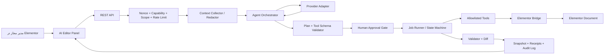

# دستور ساخت نهایی: افزونهٔ Production-Ready «AI Elementor Agent»

**نسخهٔ سند:** 1.0  
**زبان محصول:** فارسی با پشتیبانی کامل RTL و قابلیت ترجمه  
**نام افزونه:** AI Elementor Agent  
**Slug و Text Domain:** `ai-elementor-agent`  
**REST Namespace:** `ai-elementor/v1`

> **این سند یک مشخصات ساخت الزام‌آور است، نه نمونهٔ نمایشی.** خروجی باید یک افزونهٔ واقعی، قابل‌نصب، قابل‌آزمون، امن و قابل‌استفاده در WordPress + Elementor باشد. از mock، دادهٔ ساختگی، handler نیمه‌کاره، TODO برای مسیرهای اصلی، یا ادعای انجام عملیاتی که واقعاً انجام نشده است استفاده نکن.

---

## ۱. مأموریت محصول

شما نقش یک **Senior WordPress Plugin Architect، Senior PHP Developer، Senior TypeScript Developer، AI Agent Engineer و Elementor Developer** را دارید. افزونه‌ای بسازید که درون Elementor Editor یک پنل عامل هوش مصنوعی فراهم کند. مدیر مجاز سایت باید بتواند provider و endpoint هوش مصنوعی را به‌شکل ایمن تنظیم کند، در پنل گفتگو هدف طراحی خود را شرح دهد، Plan قابل‌فهم و قابل‌تأیید بگیرد و سپس عامل، تغییرات صفحهٔ انتخاب‌شده را گام‌به‌گام و با گزارش دقیق در Elementor اعمال کند.

هدف افزونه ساخت یا تغییر واقعی صفحه است؛ شامل ایجاد و ویرایش container و widget، محتوا، style و responsive settingهای پشتیبانی‌شده، جابه‌جایی یا حذف عناصر مجاز، استفادهٔ کنترل‌شده از رسانه‌ها، اعتبارسنجی، diff، snapshot، rollback و audit log. با این حال، این محصول **هرگز** نباید به مدل هوش مصنوعی اجازه دهد PHP، SQL، shell command، فایل دلخواه، تنظیمات `wp-config.php`، core WordPress یا core Elementor را اجرا یا دستکاری کند.

مدل معماری محصول دقیقاً این است:

```text
AI = Brain
Plugin = Controller
Tools = Hands
Elementor Adapter = Interface to Elementor
Validator = Quality Control
Snapshot / Rollback = Safety Layer
Human Approval = Authority Gate
```

بنابراین مدل فقط هدف، Plan و فراخوانی ابزارهای تعریف‌شده را تولید می‌کند. افزونه در سمت سرور schema، دسترسی، دامنهٔ اثر و ریسک را بررسی می‌کند و فقط سپس ابزار را اجرا می‌نماید. **هیچ متن آزاد، کد، JSON خام Elementor یا tool call مدل مستقیماً اجرا نمی‌شود.**

---

## ۲. نتیجهٔ موردانتظار و تعریف Done

نسخهٔ اولیه زمانی Done است که یک مدیر مجاز بتواند در Elementor صفحهٔ Draft را باز کند و به فارسی بنویسد: «یک Hero راست‌چین با عنوان، توضیح، تصویر و دکمهٔ CTA بساز». افزونه باید context حداقلی و مجاز صفحه را تهیه کند، Plan ساخت‌یافته نشان دهد، تأیید بگیرد، هر action را به‌صورت قابل‌مشاهده اجرا کند، وضعیت و receipt هر گام را نمایش دهد، سند را اعتبارسنجی کند و در پایان یک گزارش صادقانه از معیارهای پاس‌شده یا خطاهای باقی‌مانده ارائه دهد. کاربر باید قادر باشد آخرین action، کل Plan یا یک snapshot مشخص را rollback کند.

| معیار | رفتار اجباری |
|---|---|
| ایمنی | کلید API در browser، REST response، source یا log کامل دیده نشود. |
| کنترل انسانی | تغییرات mutation در MVP فقط روی Draft و پس از approval صریح اجرا شوند. |
| شفافیت | Plan، actionها، ریسک، diff، پیشرفت و خطاها قابل‌دیدن باشند. |
| صحت | هر action پیش و پس از اجرا validate شود و receipt داشته باشد. |
| بازیابی | پیش از mutation مهم snapshot گرفته شود؛ restore عملی و آزموده‌شده باشد. |
| سازگاری | منطق Elementor پشت Adapter/Bridge باشد؛ هیچ تغییر در core Elementor انجام نشود. |
| صداقت | اگر widget یا کنترل پشتیبانی نمی‌شود، عامل باید آن را رد یا جایگزین پیشنهادی ارائه کند؛ نه اینکه موفقیت جعلی اعلام کند. |

---

## ۳. پروتکل اجباری پیش از کدنویسی

پیش از تغییر یا ایجاد هر فایل، این مراحل را انجام دهید. اگر مخزن موجود است، ابتدا tree، فایل bootstrap، composer/package configuration، testها، CI، مستندات و کدهای مرتبط را بررسی کنید. سپس نسخهٔ واقعی PHP، WordPress و Elementor محیط توسعه را مشخص و در `CompatibilityMatrix.md` ثبت کنید. مستندات رسمی Elementor دربارهٔ data structure، widget/control و APIهای editor و همچنین مستندات رسمی WordPress دربارهٔ REST route، nonce، capability، Settings API، sanitization و escaping را بررسی کنید.

از APIهای عمومی و مستند Elementor در هرجا که نیاز را پوشش می‌دهند استفاده کنید. تغییر state پایدار صفحه با دستکاری DOM editor ممنوع است. هیچ‌کجای افزونه، خارج از `ElementorBridge`، اجازهٔ خواندن یا نوشتن دادهٔ سند Elementor ندارد. اگر یک عملیات فقط با API داخلی یا undocumented ممکن است، ابتدا راه رسمی را بررسی کنید؛ در صورت نبود راه پایدار، آن عملیات را در MVP فعال نکنید یا آن را پشت feature flag، compatibility test و یک adapter ایزوله قرار دهید. افزونه نباید برای اجرای اصلی خود به نسخهٔ خاصی از Elementor قفل شود.

WordPress دادهٔ REST را غیرقابل‌اعتماد تلقی می‌کند و برای endpointهای خصوصی به `permission_callback` نیاز دارد؛ nonce نیز جایگزین authentication یا authorization نیست. [1] [2] Elementor نیز ساختار صفحه را به‌شکل JSON ذخیره می‌کند؛ این موضوع دلیل نیاز به validation و isolation است، نه مجوزی برای نوشتن مستقیم و پراکنده در post meta. [3]

---

## ۴. دامنهٔ محصول و مرزهای روشن

«خواندن کل محیط» به معنای دسترسی بی‌حد نیست. عامل فقط باید **محیط انتخاب‌شده، لازم و مجاز** را بخواند. در حالت پیش‌فرض این دامنه شامل document صفحهٔ جاری، عناصر و تنظیمات آن، selection فعلی، کاتالوگ widgetهای فعال، global colors/fonts و در صورت فعال‌سازی کاربر، اطلاعات محدود design system و templateهای مجاز است.

| سطح context | موارد مجاز | سیاست پیش‌فرض |
|---|---|---|
| Current Context | selection، parent، siblingهای نزدیک، tree و تنظیمات صفحهٔ جاری | فعال |
| Site Context | global colors، global fonts، theme name، templateهای مجاز، header/footer به‌صورت خلاصه | opt-in مدیر |
| Project Context | برند، مخاطب، tone، قوانین SEO/محتوا، design tokens و دستورالعمل سفارشی | قابل‌ویرایش در settings |
| Sensitive Context | secret، کلید API، cookie، فرم، PII، کاربران، سفارش‌ها، wp-config و فایل سیستم | همیشه ممنوع |

HTML کامل سایت، post meta خام، cookie، password، secret، token، داده‌های فرم، شناسه‌های شخصی و محتواهای نامرتبط هرگز نباید بدون redaction و scope صریح به provider خارجی ارسال شوند. Context باید normalized، filtered، summarized و با token budget مشخص باشد؛ نه یک dump حجیم از دادهٔ خام Elementor.

---

## ۵. تصمیم‌های فنی پایه

پروژه از PHP 8.1+، WordPress Coding Standards، autoload PSR-4، `declare(strict_types=1)`، TypeScript strict mode و build مدرن جاوااسکریپت استفاده کند. نسخهٔ حداقلی نهایی WordPress و Elementor فقط پس از ساخت matrix واقعی تست‌ها در header و readme ثبت شود. هر dependency جدید باید ضرورت، license، security و اندازهٔ bundle مشخص داشته باشد. از dependency سنگین برای مسئله‌ای که WordPress یا PHP standard library آن را حل می‌کند، استفاده نکنید.

از Dependency Injection استفاده کنید. فایل اصلی افزونه فقط header، autoload، compatibility gate و boot container را دارد. هیچ business logic، query دیتابیس، route handler یا call provider در فایل اصلی قرار نگیرد.

```text
ai-elementor-agent/
├── ai-elementor-agent.php
├── uninstall.php
├── readme.txt
├── composer.json
├── package.json
├── phpunit.xml.dist
├── .gitignore
├── phpcs.xml.dist
├── phpstan.neon
├── CompatibilityMatrix.md
├── languages/
├── assets/
│   ├── build/                         # فقط خروجی bundle نسخه‌دار
│   └── src/
│       ├── admin/
│       ├── editor/
│       ├── shared/
│       └── styles/
├── src/
│   ├── Core/
│   │   ├── Plugin.php
│   │   ├── Container.php
│   │   ├── ServiceProvider.php
│   │   ├── HookLoader.php
│   │   ├── Config.php
│   │   └── CompatibilityGuard.php
│   ├── Admin/
│   │   ├── SettingsPage.php
│   │   ├── ProviderSettingsController.php
│   │   ├── SettingsSanitizer.php
│   │   └── Capabilities.php
│   ├── Editor/
│   │   ├── EditorAssets.php
│   │   ├── PanelBootstrap.php
│   │   ├── EditorContextBridge.php
│   │   └── LocalizedConfig.php
│   ├── Rest/
│   │   ├── Routes.php
│   │   ├── ChatController.php
│   │   ├── PlanController.php
│   │   ├── JobController.php
│   │   ├── ContextController.php
│   │   ├── ProviderController.php
│   │   └── RestError.php
│   ├── AI/
│   │   ├── AIManager.php
│   │   ├── ProviderInterface.php
│   │   ├── ProviderRegistry.php
│   │   ├── ModelCatalog.php
│   │   ├── OpenAICompatibleProvider.php
│   │   ├── OpenAIProvider.php
│   │   ├── AnthropicProvider.php
│   │   ├── GeminiProvider.php
│   │   ├── HttpClient.php
│   │   ├── SecretManager.php
│   │   └── UsageMeter.php
│   ├── Agent/
│   │   ├── Orchestrator.php
│   │   ├── Planner.php
│   │   ├── Executor.php
│   │   ├── StateMachine.php
│   │   ├── TaskQueue.php
│   │   ├── MemoryService.php
│   │   ├── RepairEngine.php
│   │   ├── PromptBuilder.php
│   │   └── ContextBudget.php
│   ├── Tools/
│   │   ├── ToolInterface.php
│   │   ├── ToolRegistry.php
│   │   ├── ToolDefinition.php
│   │   └── Elementor/
│   ├── Elementor/
│   │   ├── ElementorBridge.php
│   │   ├── ElementorReader.php
│   │   ├── ElementorWriter.php
│   │   ├── ElementorContext.php
│   │   ├── CapabilityCatalog.php
│   │   ├── WidgetRegistry.php
│   │   ├── WidgetAdapter.php
│   │   ├── ContainerAdapter.php
│   │   ├── StyleAdapter.php
│   │   ├── ResponsiveAdapter.php
│   │   ├── DocumentTransaction.php
│   │   ├── DocumentValidator.php
│   │   └── Compatibility/
│   ├── Policy/
│   │   ├── PolicyEngine.php
│   │   ├── ScopePolicy.php
│   │   ├── RiskClassifier.php
│   │   ├── ApprovalPolicy.php
│   │   ├── PlanSchemaValidator.php
│   │   └── RateLimiter.php
│   ├── Jobs/
│   │   ├── JobRepository.php
│   │   ├── JobRunner.php
│   │   ├── LockManager.php
│   │   └── RetryPolicy.php
│   ├── Database/
│   │   ├── Installer.php
│   │   ├── Migrator.php
│   │   └── Repositories/
│   ├── Audit/
│   │   ├── AuditLogger.php
│   │   ├── SnapshotRepository.php
│   │   ├── RollbackService.php
│   │   └── DiffService.php
│   ├── Media/
│   │   └── MediaService.php
│   ├── Domain/
│   │   ├── DTO/
│   │   ├── Enum/
│   │   ├── Exception/
│   │   └── ValueObject/
│   └── Support/
│       ├── Sanitizer.php
│       ├── Encryption.php
│       ├── Logger.php
│       └── Clock.php
├── templates/
│   ├── admin/
│   └── editor/
└── tests/
    ├── Unit/
    ├── Integration/
    ├── E2E/
    ├── Security/
    └── Fixtures/
```

---

## ۶. معماری کلان و جریان داده



| لایه | مسئولیت | ممنوعیت |
|---|---|---|
| Editor Panel | chat، plan، diff، approval، progress و rollback UI | نگهداری secret یا mutation مستقیم document |
| REST | احراز هویت، validate request و پاسخ استاندارد | اجرای provider یا widget بدون policy |
| Context | خواندن، normalization، redaction و بودجه‌بندی داده | ارسال dump خام یا دادهٔ حساس |
| Agent | تبدیل هدف به Plan، مدیریت state و انتخاب tool مجاز | تغییر مستقیم Elementor یا database |
| AI Manager | انتخاب provider/model، structured output، streaming و retry شبکه | دسترسی به document یا capability WordPress |
| Tool Registry | allowlist ابزار و schema قطعی argument | expose کردن API عمومی WordPress به مدل |
| Elementor Bridge | ترجمهٔ intent معتبر به عملیات document | اجرای raw output مدل |
| Policy/Validator | permission، risk، schema، precondition و postcondition | تغییر بی‌صدای هدف کاربر |
| Audit/Recovery | snapshot، receipt، diff و rollback | log کردن key یا context حساس |

---

## ۷. lifecycle عامل و State Machine

عامل باید state machine پایدار، نسخه‌دار و audit-friendly داشته باشد. هر تغییر state یک event log داشته باشد و stateهای نامعتبر قابل‌پرش نباشند.

```text
IDLE
  → ANALYZING
  → PLANNING
  → WAITING_APPROVAL
  → EXECUTING
  → VALIDATING
  → REPAIRING (فقط با policy و retry محدود)
  → COMPLETED
  ↘ FAILED | CANCELLED | NEEDS_REVIEW | ROLLED_BACK
```

ابتدا context گرفته می‌شود. سپس مدل فقط Plan ساخت‌یافته تولید می‌کند. Plan قبل از نمایش و اجرا از schema، capability catalog، permission، parent id، required parameter، allowlist widget و risk policy عبور می‌کند. پس از approval، هر step به Task مستقل تبدیل می‌شود. Job runner فقط یک action کوچک را در هر transaction اجرا می‌کند؛ بعد precondition/postcondition و hash document بررسی می‌شوند. در پایان، validator نتیجه را گزارش می‌کند و در صورت خطا repair فقط در محدودهٔ action شکست‌خورده و retry policy اجرا می‌شود.

| وضعیت Task | معنا |
|---|---|
| `pending` | آمادهٔ اجرا و منتظر dependency یا نوبت |
| `waiting_approval` | action پرریسک یا plan تأیید نشده است |
| `running` | lock معتبر روی صفحه و action فعال است |
| `completed` | receipt، validation و after-hash ثبت شده‌اند |
| `retrying` | فقط خطای گذرا و retry مجاز رخ داده است |
| `failed` | خطا قابل‌تکرار نیست یا retry تمام شده است |
| `cancelled` | کاربر یا policy اجرا را متوقف کرده است |
| `needs_review` | conflict، تغییر خارجی یا وضعیت مبهم نیازمند بازبینی دارد |

Auto mode فقط برای actionهای low-risk و approved اجرا می‌شود و در MVP صرفاً روی Draft فعال است. Step-by-step mode دکمه‌های `Approve Next`، `Run Remaining`، `Pause`، `Cancel`، `Rollback Last Task` و `Restore Snapshot` دارد. قابلیت `Run Remaining` نباید action پرریسک یا خارج از approval اولیه را بدون تأیید مجدد اجرا کند.

---

## ۸. Provider، endpoint و مدیریت مدل

Agent Core نباید به provider خاصی وابسته باشد. Providerها پشت یک contract مشخص قرار گیرند و تمام خطاهای شبکه به exceptionهای دامنه‌ای نرمال تبدیل شوند.

```php
interface ProviderInterface
{
    public function id(): string;

    public function capabilities(): ProviderCapabilities;

    /** @param list<AIMessage> $messages */
    public function send(array $messages, AIRequestOptions $options): AIResponse;

    /** Streaming فقط برای پیام نمایشی؛ نه اجرای مستقیم tool. */
    public function stream(array $messages, AIRequestOptions $options, callable $onEvent): void;

    /** @return list<ModelDefinition> */
    public function models(): array;

    public function testConnection(): ProviderHealth;
}
```

providerهای اولیه شامل OpenAI، Anthropic، Google Gemini و OpenAI-Compatible هستند. مدل provider در `ModelCatalog` با provider، model ID، display name، tool calling، streaming، vision، JSON Schema/structured output، context window و وضعیت فعال نگه‌داری می‌شود. Agent پیش از اجرا بررسی می‌کند که مدل انتخاب‌شده structured output و tool-calling لازم را دارد؛ در نبود این قابلیت، اجرای Build شروع نمی‌شود.

OpenAI-Compatible provider باید تنظیمات نام، base URL، API key، model، organization، headerهای allowlisted، timeout، max token، temperature و streaming داشته باشد. با این حال، تنظیم «custom endpoint» نباید به یک proxy دلخواه یا interpreter قابل‌برنامه‌ریزی تبدیل شود. در نسخهٔ اول، endpoint سفارشی فقط برای schema سازگار با OpenAI یا یک mapping کاملاً declarative و محدود قابل‌قبول است؛ اجرای JavaScript/PHP، template expression، transform code، dynamic import یا response parser قابل‌اجرا ممنوع است.

تمام URLها باید `https` باشند، مگر حالت توسعهٔ محلی که صریحاً فعال شده است. hostname، scheme، port، redirect، DNS resolution، IPهای loopback/private/link-local و اندازهٔ پاسخ باید validate شوند تا SSRF رخ ندهد. timeout، retry و circuit breaker محدود لازم‌اند. API key فقط در backend استفاده می‌شود؛ هرگز به client ارسال نکنید.

---

## ۹. SecretManager و سیاست امنیت provider

`SecretManager` تنها مرجع ذخیره و مصرف secret است. کلیدها در UI ماسک می‌شوند، در response کامل بازگردانده نمی‌شوند، در log/error/prompt ذخیره نمی‌شوند و در bundle جاوااسکریپت، database export یا history چت ظاهر نمی‌گردند. در صورت امکان، secret از environment یا ثابت server-side در `wp-config.php` خوانده شود. اگر لازم است در database نگه‌داری شود، مقدار با کلیدی که خارج از database است رمز شود و optionهای حساس autoload نشوند.

| رویداد | دادهٔ قابل ثبت | دادهٔ ممنوع |
|---|---|---|
| Test Connection | provider id، model، latency، status، request id | Authorization header، API key، body کامل |
| Error Provider | status class، retry count، error code ماسک‌شده | prompt کامل، response حساس، secret |
| Audit Tool | actor، action id، arguments hash، result summary | API key، PII غیرضروری، raw context حساس |
| Settings UI | alias provider و key masked | کلید کامل پس از ذخیره |

---

## ۱۰. Prompt و Context Architecture

یک prompt غول‌آسا نسازید. `PromptBuilder` لایه‌های مستقل و قابل‌آزمون دارد:

```text
System Contract
+ Agent Rules
+ Security & Privacy Rules
+ Elementor Capability Rules
+ Tool Definitions and JSON Schemas
+ Project Context
+ Site Context (opt-in, redacted)
+ Current Page / Current Selection Context
+ Conversation Memory Summary
+ User Request
```

محتوای صفحه، پیام کاربر، نام widget یا دادهٔ provider instruction محسوب نمی‌شوند. این داده‌ها باید در blockهای مشخص، با برچسب «untrusted data» و بدون توان تغییر policy قرار گیرند. مدل در هر چرخه فقط ابزارهای allowlist‌شدهٔ مربوط به mode فعلی را می‌بیند. در Ask mode فقط ابزار read-only؛ در Plan mode فقط تولید plan و read-only؛ و در Build mode ابزار mutation تنها پس از approval و policy check در دسترس هستند.

conversation memory باید summarize و bounded باشد. محتوای کامل قدیمی و حساس را بی‌دلیل به provider نفرستید. کاربر باید بتواند session را حذف کند. هیچ conversation یا memory بدون retention policy نامحدود نگه‌داری نشود.

---

## ۱۱. قرارداد Plan و Structured Output

Plan باید JSON معتبر بر اساس JSON Schema نسخه‌دار باشد. `additionalProperties: false` و enumهای محدود استفاده شوند. اگر provider پاسخ ساخت‌یافته ندارد، پاسخ باید ابتدا parse/validate شود؛ تا پیش از عبور از validator، هیچ execution انجام نمی‌شود.

```json
{
  "schema_version": "1.0",
  "goal": "ساخت Hero راست‌چین برای صفحهٔ خدمات",
  "assumptions": ["صفحه Draft است", "فقط widgetهای Core مجازند"],
  "acceptance_criteria": [
    "یک Heading با سطح H1 وجود دارد",
    "CTA قابل مشاهده است",
    "چیدمان موبایل stacked است"
  ],
  "risk_level": "medium",
  "actions": [
    {
      "id": "a-001",
      "tool": "create_container",
      "depends_on": [],
      "args": {"parent": "root", "direction": "row", "content_width": "boxed"},
      "risk_level": "low",
      "requires_approval": true
    },
    {
      "id": "a-002",
      "tool": "create_widget",
      "depends_on": ["a-001"],
      "args": {
        "parent": "$a-001",
        "widget_type": "heading",
        "settings": {"title": "عنوان نمونه", "header_size": "h1"}
      },
      "risk_level": "low",
      "requires_approval": false
    }
  ]
}
```

پیش از اجرا، validator باید schema، ترتیب dependency، tool name، argument type، widget allowlist، parent id، document hash، required parameter، control schema، capability کاربر، current scope و approval status را بررسی کند. Plan نامعتبر فقط با پیام قابل‌فهم به UI بازگردد و به Task تبدیل نشود.

---

## ۱۲. Tool Registry و سیاست ابزارها

هر ابزار contract قطعی دارد و باید schema ورودی، schema خروجی، permission، risk level، precondition و postcondition مشخص داشته باشد.

```php
interface ToolInterface
{
    public function name(): string;

    public function definition(): ToolDefinition;

    public function execute(ToolInvocation $invocation): ToolResult;
}
```

ابزارها به سه دسته تقسیم می‌شوند. دستهٔ Read شامل `get_current_page`، `get_page_context`، `get_elementor_tree`، `get_selected_element`، `get_element`، `find_element`، `get_widget_schema`، `get_global_colors`، `get_global_fonts`، `get_page_settings`، `search_media` و `get_media` است. دستهٔ Write شامل `create_container`، `create_widget`، `update_widget`، `delete_element`، `move_element`، `duplicate_element`، `set_style`، `set_responsive_style`، `set_background`، `set_typography`، `set_spacing`، `set_alignment`، `upload_media`، `save_page` و در نسخهٔ بعد `create_page` است. دستهٔ Safety شامل `validate_page`، `create_snapshot`، `restore_snapshot`، `rollback` و `get_diff` است.

هر ابزار write باید قبل از mutation `DocumentTransaction` داشته باشد. برای actionهای destructive مانند delete و replace، تأیید مجزا لازم است. ابزارهای زیر **نباید تحت هیچ شرایطی وجود داشته باشند**:

```text
execute_php
exec / shell_exec / system / passthru
execute_sql
run_command
eval
arbitrary_file_write
modify_wp_config
modify_core_files
create_admin_user
delete_admin
install_plugin_from_url
arbitrary_http_request
```

مدل همچنین نباید مستقیم به `wp_insert_post`، `$wpdb`، filesystem یا HTTP client دسترسی داشته باشد. اگر ابزار یا policy چیزی را پشتیبانی نمی‌کند، پاسخ باید آن را صریحاً اعلام و یک راهکار امن جایگزین پیشنهاد کند.

---

## ۱۳. Elementor Bridge و Capability Catalog

Elementor یک لایهٔ جدا و قابل‌تعویض است. `ElementorReader` document را تا حد API عمومی و قابل‌اتکا می‌خواند و به یک مدل داخلی normalized تبدیل می‌کند. `ElementorWriter` فقط intent تأییدشده را اعمال می‌کند. `DocumentTransaction` قفل، snapshot، بررسی hash، write، parse مجدد، validation، invalidation cache و receipt را هماهنگ می‌کند.

```json
{
  "id": "abc123",
  "element_type": "widget",
  "widget_type": "heading",
  "parent_id": "container123",
  "settings": {},
  "styles": {},
  "responsive": {},
  "children": []
}
```

Widgetها hard-code نشوند. در هر سایت `CapabilityCatalog` از widgetهای فعال و adapterهای پشتیبانی‌شده ساخته شود. Elementor widgetها را با category و controlهای اختصاصی مدیریت می‌کند؛ addonها نیز می‌توانند widget ثبت یا حذف کنند، پس یک فهرست runtime و allowlist برای agent ضروری است. [4]

| فیلد registry | شرح |
|---|---|
| `widget_type`، `name`، `category` و `provider` | شناسایی widget و منبع آن |
| `controls` و `required_settings` | schema کنترل‌های مجاز و لازم |
| `supports_children` | امکان parent بودن widget/container |
| `supports_styles` و `supports_responsive` | دامنهٔ style و breakpointهای مجاز |
| `capability_level` | `simple`، `advanced`، `dynamic`، `third_party` یا `unsupported` |
| `risk_level` و `adapter_version` | تصمیم policy و سازگاری |

در MVP فقط Container، Heading، Text Editor، Image، Button، Divider و Spacer از widgetهای Core پشتیبانی می‌شوند. HTML، Shortcode، Custom Code، Form، Login، Payment، widget دارای script، widget dynamic بدون adapter و هر widget third-party ناشناخته به‌طور پیش‌فرض در catalog agent ظاهر نمی‌شوند. پشتیبانی از widget third-party فقط با adapter مستقل، schema مشخص و integration test مجاز است.

برای کنترل‌ها یک schema داخلی داشته باشید تا تفاوت text، number، choose، media، unit، dimensions، typography و group control حفظ شود. parser کنترل هرگز نباید تنظیمات ناشناخته یا raw key/value خارج از allowlist را اعمال کند.

---

## ۱۴. سازگاری با Elementor Editor

AI Panel در editor به‌شکل UI بومی Elementor بارگذاری شود. assets فقط در صفحه/حالت لازم enqueue شوند و با version/hash bundle cache-bust شوند. UI باید از hook و extension pointهای رسمی editor استفاده کند. برای state موقت selection و تعامل UI، bridge جاوااسکریپت می‌تواند از API/Hookهای editor استفاده کند؛ برای mutation پایدار document، همه‌چیز باید از REST server-side، policy و `ElementorBridge` عبور کند. از query DOM شکننده برای استخراج یا ساخت page state ماندگار استفاده نکنید.

رابط شامل Status، Current Page، Current Selection، mode، provider/model فعال، chat، plan، task list، diff، progress، error detail، tool receipt و actionهای approval/rollback است. UI فارسی و RTL کامل باشد؛ ولی URL، model ID، API key masked، hash و کدها در isolation LTR و font monospace نمایش داده شوند.

| Mode گفتگو | توانایی |
|---|---|
| Ask | توضیح و پیشنهاد؛ فقط read-only context |
| Plan | ایجاد/اصلاح Plan؛ بدون mutation |
| Build | اجرای Plan تأییدشده در scope مجاز |

Streaming صرفاً برای نمایش پیام و status است. هیچ event stream سمت browser حق trigger کردن ابزار write یا تغییر مستقیم document ندارد؛ تنها backend پس از validation مجاز به ایجاد Job است.

---

## ۱۵. REST API و کنترل دسترسی

تمام مسیرها زیر `ai-elementor/v1` نسخه‌دار شوند. endpoint عمومی برای chat یا key وجود ندارد. هر request تغییر‌دهنده نیازمند authentication، nonce، `permission_callback`، scope، capability مربوط به همان page، input/schema validation، `Idempotency-Key` و `context_hash` است. capability سفارشی می‌تواند تعریف شود، اما باید با capabilityهای واقعی WordPress و `edit_post($post_id)` ترکیب گردد؛ هرگز صرف وجود یک capability global برای تغییر هر صفحه کافی نیست.

| Method / Route | هدف | مجوز حداقلی |
|---|---|---|
| `POST /sessions` | ساخت session و context حداقلی | `edit_post(post_id)` + `use_ai_elementor` |
| `POST /chat` | پیام Ask/Plan و پاسخ streaming/non-streaming | مالک session + مجوز صفحه |
| `POST /plan` | ایجاد یا بازتولید Plan | مالک session + مجوز صفحه |
| `GET /context` | context summary و catalog امن | `edit_post(post_id)` |
| `GET /widgets` | capability catalog فیلترشده | `edit_post(post_id)` |
| `POST /plans/{id}/approve` | تأیید actionها و ساخت Job | `execute_ai_actions` + مجوز صفحه |
| `POST /execute/{job_id}/next` | اجرای action بعدی | مالک job + مجوز صفحه |
| `POST /execute/{job_id}/pause` | توقف امن پس از action جاری | مالک job + مجوز صفحه |
| `POST /execute/{job_id}/cancel` | لغو Job | مالک job + مجوز صفحه |
| `GET /status/{job_id}` | timeline، receipt و status | مالک job + مجوز صفحه |
| `POST /rollback` | restore snapshot یا rollback action/plan | مجوز صفحه + تأیید صریح |
| `GET /providers` | provider/modelهای بدون secret | `manage_ai_elementor` |
| `POST /providers/test` | تست اتصال backend | `manage_ai_elementor` |

`manage_ai_elementor` برای تنظیم provider و policy، `use_ai_elementor` برای باز کردن پنل، و `execute_ai_actions` برای mutation تعریف شوند. در activation این capabilityها به role مناسب با سیاست محافظه‌کارانه داده شوند و در uninstall بدون رضایت مدیر حذف نشوند. تمام پاسخ‌های خطا شامل `request_id`، code، message امن و در حالت توسعه detail قابل‌فیلتر باشند؛ هیچ stack trace یا secret به browser برنگردد.

---

## ۱۶. دیتابیس، session، task و audit

settings کوچک غیرحساس در option با `autoload = no` نگه‌داری شوند. providerهای حساس، modelها، conversation، job، task، receipt، snapshot، usage و log در custom tableهای migration-versioned با `dbDelta()` نگه‌داری شوند. migrationها idempotent باشند و uninstall داده را فقط اگر مدیر صریحاً گزینهٔ حذف کامل را فعال کرده است پاک کند.

| جدول | هدف و فیلدهای کلیدی |
|---|---|
| `wp_ai_elementor_providers` | type، alias، endpoint config رمزنگاری‌نشدهٔ امن، secret reference، status |
| `wp_ai_elementor_models` | provider id، model ID، capabilities، enabled |
| `wp_ai_elementor_conversations` | user id، page id، provider/model، scope، state، context hash |
| `wp_ai_elementor_messages` | conversation id، role، content redacted، tool call id، metadata محدود |
| `wp_ai_elementor_plans` | session/conversation id، version، plan JSON، approval state، risk |
| `wp_ai_elementor_jobs` | plan id، page id، state، cursor، lock، initial document hash |
| `wp_ai_elementor_tasks` | job id، action id، dependency، args hash، status، retry، result summary |
| `wp_ai_elementor_task_logs` | task id، event، duration، error code، receipt hash |
| `wp_ai_elementor_snapshots` | page id، document hash، compressed data، size، expires at |
| `wp_ai_elementor_usage` | provider/model، token/operation estimate، time، actor |
| `wp_ai_elementor_memory` | project-level approved preferences با retention و privacy policy |

Taskها `id`، conversation/job id، parent/dependency، step number، action، arguments hash، status، result summary، error code، retries و timestampهای کامل دارند. برای retry و refresh مرورگر، action ID و idempotency key یکتا است؛ درخواست تکراری باید receipt قبلی را برگرداند، نه اینکه widget دوم بسازد.

Audit log باید actor، page، conversation، job/task، tool، arguments hash، result summary، status، duration، error code و timestamp را ثبت کند. secret، Authorization، prompt حساس، raw PII و API key هرگز log نشوند.

---

## ۱۷. Snapshot، diff، rollback و conflict

پیش از هر mutation پرریسک، `DocumentTransaction` باید: document و hash فعلی را دوباره بخواند، با context hash اولیه مقایسه کند، snapshot بسازد، action را اجرا کند، document نهایی را parse و validate کند، receipt و diff بسازد، و فقط در موفقیت commit نماید. اگر کاربر دیگری در طول اجرا صفحه را تغییر داده باشد، hash mismatch رخ می‌دهد؛ Job به `needs_review` می‌رود و بدون بازنویسی تغییرات دیگران متوقف می‌شود.

Snapshotها باید محدودیت تعداد، حجم و retention داشته باشند؛ برای مثال فقط آخرین ده snapshot یا مدت زمان قابل‌تنظیم. Rollback شامل `Undo Last Task`، `Rollback Current Plan`، `Rollback Conversation` و `Restore Snapshot` است. هر rollback هم audit log، confirmation و validation دارد.

Diff قابل‌فهم در UI ارائه کنید:

```text
Added:    Heading, Button
Modified: Hero Container Padding, Heading Font Size
Deleted:  Old CTA
```

از diff ساخت‌یافته بر اساس tree normalized استفاده کنید، نه مقایسهٔ متن JSON خام. نمایش diff باید نشان دهد چه صفحه‌ای، چه widgetی و چه settingی تغییر می‌کند.

---

## ۱۸. Security، privacy و resilience requirements

امنیت یک feature اختیاری نیست. nonce فقط از دسته‌ای از درخواست‌های جعلی محافظت می‌کند و نباید به‌عنوان access control استفاده شود؛ باید کنار capability و permission check به کار رود. [2]

| ریسک | کنترل اجباری |
|---|---|
| CSRF | nonce در mutationها و capability server-side |
| IDOR / دسترسی افقی | ownership session/job و `edit_post(post_id)` در همهٔ مسیرها |
| XSS | validate، sanitize در مرز ورودی و escape متناسب با context در خروجی؛ HTML/script ممنوع در MVP |
| Prompt injection | جداسازی دادهٔ غیرقابل‌اعتماد از instruction؛ allowlist ابزار؛ عدم پذیرش directive از page content |
| SSRF | HTTPS، allowlist endpoint، منع IP خصوصی/loopback، کنترل redirect و timeout |
| Secret leakage | SecretManager، masking، حذف از log/response/prompt/client |
| هزینه و abuse | rate limit per-user/per-site، usage cap، max tokens، max actions و circuit breaker |
| تخریب صفحه | approval، snapshot، hash conflict، action کوچک، receipt و rollback |
| انقضای Job | TTL lock، heartbeat، recovery به `needs_review` به‌جای ادامهٔ کورکورانه |

Rate limitها و سقف‌ها در settings قابل تنظیم اما دارای default محافظه‌کارانه باشند. Jobها نباید به بازماندن browser tab وابسته باشند؛ برای کارهای طولانی runner قابل‌بازیابی با cron واقعی سرور یا سازوکار queue مناسب تهیه شود. در نسخهٔ اول اجرای هر action با request کوتاه و polling status قابل‌قبول است، اما نباید PHP request بی‌انتها یا loop بدون timeout داشته باشد.

---

## ۱۹. Validation و Repair

Validation چندلایه طراحی شود. ابتدا schema و precondition، سپس ساختار normalized document بعد از mutation، سپس معیارهای Plan مانند وجود H1، وجود CTA، parent معتبر، widget مجاز، style/property مجاز و responsive ruleهای پشتیبانی‌شده بررسی می‌شود. اگر امکان render check قابل‌اتکا وجود دارد، آن را به‌صورت اختیاری و غیرقطعی در گزارش بیاورید؛ screenshot یا تحلیل بصری نباید بدون تأیید policy جایگزین validation ساختاری شود.

Repair Engine فقط در این شرایط اجازهٔ اقدام دارد: خطا گذراست یا validator دلیل روشن و remedy محدود ارائه کرده است، action در scope فعلی است، retry count از سقف پایین‌تر است و repair تغییر پرریسک جدیدی ایجاد نمی‌کند. در غیر این صورت، Job باید failed یا needs_review شود و UI توضیح دقیق بدهد.

> هر پاسخ نهایی عامل باید مبتنی بر receipt و validation باشد. عبارت «کامل شد» فقط هنگامی مجاز است که همهٔ actionهای ضروری completed شده و معیارهای پذیرش گزارش‌شده پاس شده باشند؛ در غیر این صورت باید وضعیت «نیازمند بازبینی» یا «ناقص» اعلام شود.

---

## ۲۰. آزمون، کیفیت و CI

از روز اول test fixture برای documentهای Elementor بسازید: صفحهٔ خالی، container تو در تو، Heading، Image، Button، تنظیمات responsive، RTL، تغییر هم‌زمان و صفحهٔ بزرگ. testها باید روی هر تغییر اجرا شوند. برای provider، HTTP mock contract test مجاز است، اما مسیر اصلی نباید mock-only بماند؛ integration test قابل‌پیکربندی با provider sandbox یا fake server قابل‌کنترل داشته باشید.

| سطح تست | موارد ضروری |
|---|---|
| Unit | schema validator، policy، sanitizer، tool argument، state machine، retry، redaction و diff |
| Contract | mapping provider، structured output، timeout، 429/5xx و streaming event parsing |
| Integration | REST، nonce، capability، database migration، lock، snapshot و ElementorBridge |
| Document fixture | ایجاد/ویرایش واقعی widgetهای MVP و validation structure بعدی |
| E2E | پنل editor، Plan، approval، progress، cancel و rollback |
| Security | CSRF، IDOR، secret leakage، XSS، SSRF، prompt injection و arbitrary tool denial |
| Compatibility | matrix واقعی PHP/WordPress/Elementor/Elementor Pro و plugin addonهای adapterدار |
| Performance | context بزرگ، catalog پرحجم، actions متعدد، time/memory ceiling و concurrency |

در CI حداقل lint PHP/TypeScript، WordPress Coding Standards، static analysis، unit/integration test و build asset اجرا شوند. هیچ release با warning/deprecation مسیر اصلی، migration شکست‌خورده، test rollback شکست‌خورده یا نشت secret در scan log منتشر نشود.

---

## ۲۱. UI/UX و قابلیت استفاده

پنل باید حس یک ابزار حرفه‌ای کنترل‌شده داشته باشد، نه یک chatbox مبهم. کاربر باید پیش از هر تغییر بداند «چه چیزی»، «کجا»، «چرا»، «با چه ریسکی» و «چگونه قابل‌بازگشت» تغییر می‌کند.

| بخش | محتوای لازم |
|---|---|
| Header | نام افزونه، وضعیت provider، نام صفحه، Draft/Published و mode |
| Context bar | selection فعلی، scope داده، context hash و هشدار privacy |
| Chat | ارسال، streaming، cancel، retry و تاریخچهٔ کنترل‌شده |
| Plan | goal، assumptions، acceptance criteria، actionها، risk و dependency |
| Approval | انتخاب action، هشدار destructive، تأیید و diff before/after |
| Task timeline | pending/running/completed/failed/retrying و receipt هر گام |
| Completion | گزارش validation، موارد انجام‌شده، موارد ناموفق، link preview و rollback |
| Settings | provider/model، secret masked، usage cap، context scope، retention و test connection |

در UI هرگز دکمه‌ای با رفتار مبهم مانند «Build Everything» که فوراً mutation گسترده ایجاد کند نگذارید. flow اصلی باید `Analyze → Plan → Review → Approve → Execute → Validate → Report` باشد. متن‌های خطا باید راهکار عملی بدهند؛ برای نمونه «widget X به دلیل نداشتن adapter پشتیبانی نمی‌شود؛ از Heading Core استفاده کنید یا adapter آن افزونه را فعال کنید.»

---

## ۲۲. برنامهٔ تحویل مرحله‌ای

| فاز | خروجی اجباری | خارج از محدوده |
|---|---|---|
| Foundation | bootstrap، DI، compatibility gate، settings امن، migration، REST base، CI | AI و mutation واقعی |
| Read-only | editor panel، context collector، catalog، provider test، Ask mode | write tool |
| Plan | chat، structured Plan، validator، approval، audit و diff پیش‌بینی‌شده | اجرای document |
| MVP Build | container + widgetهای core تعیین‌شده، snapshot، rollback، task receipt و Draft-only | widget third-party و publish |
| Hardening | lock/conflict، quota، resume، security regression، render/report | توسعهٔ گستردهٔ widget |
| Extension | adapterهای third-party انتخاب‌شده، media workflow، templateهای مجاز | پشتیبانی ادعایی از همهٔ addonها |
| Advanced | page workflow چندمرحله‌ای، design system و publication flow با تأیید جدا | اجرای بدون policy/human oversight |

پس از هر فاز، یک release candidate قابل‌نصب، test report، changelog و مستند نصب/به‌روزرسانی ارائه شود. هیچ فاز بعدی جای نقص rollback، security یا validation فاز قبلی را نپوشاند.

---

## ۲۳. خروجی‌های اجباری توسعه‌دهنده

در پایان کار، این موارد باید تحویل داده شوند: افزونهٔ zip تمیز بدون dependency development غیرضروری؛ source کامل؛ `README` فارسی و انگلیسی شامل نصب، پیش‌نیاز، تنظیم provider، محدودیت‌های حریم خصوصی، rollback و troubleshooting؛ `CompatibilityMatrix.md`؛ فایل migration؛ test suite؛ مثال fixture؛ changelog؛ و فهرست دقیق widget/toolهای پشتیبانی‌شده و ممنوع. اگر قابلیت مهمی به دلیل نبود API پایدار Elementor پیاده نشده است، آن را شفاف در «Known Limitations» ثبت کنید؛ هیچ قابلیت را فرضی اعلام نکنید.

## ۲۴. قواعد نهایی و غیرقابل‌نقض

اول، خروجی مدل فقط پیشنهاد ساخت‌یافته است و authority اجرا ندارد. دوم، mutation بدون policy، capability، schema validation، approval، snapshot و receipt ممنوع است. سوم، secret و data حساس هرگز به browser، log یا provider بدون scope نمی‌روند. چهارم، Elementor فقط از bridge تغییر می‌کند و DOM یا meta خام راه میان‌بُر عمومی نیست. پنجم، widget ناشناخته اجرا نمی‌شود. ششم، Auto mode اختیار نامحدود ندارد. هفتم، هر عملیات باید قابل‌مشاهده، قابل‌توقف و تا حد امکان قابل‌بازگشت باشد.

اگر میان سرعت پیاده‌سازی و ایمنی/سازگاری تعارض ایجاد شد، **ایمنی، دادهٔ کاربر، قابلیت rollback و صداقت محصول** اولویت دارند.

## منابع رسمی

[1]: https://developer.wordpress.org/rest-api/extending-the-rest-api/routes-and-endpoints/ "WordPress REST API Handbook — Routes and Endpoints"
[2]: https://developer.wordpress.org/apis/security/nonces/ "WordPress Developer Resources — Nonces"
[3]: https://developers.elementor.com/docs/data-structure/ "Elementor Developers — Data Structure"
[4]: https://developers.elementor.com/docs/widgets/ "Elementor Developers — Widgets"
